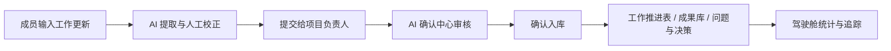
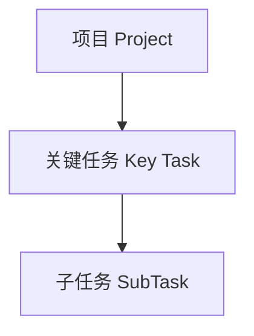
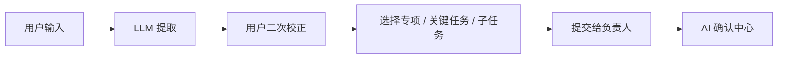
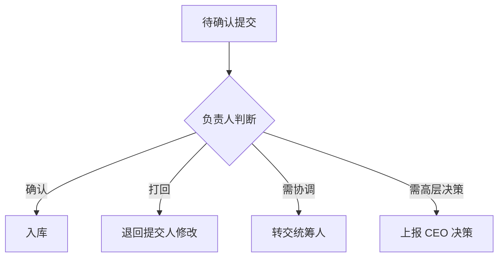
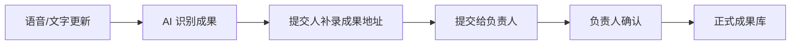
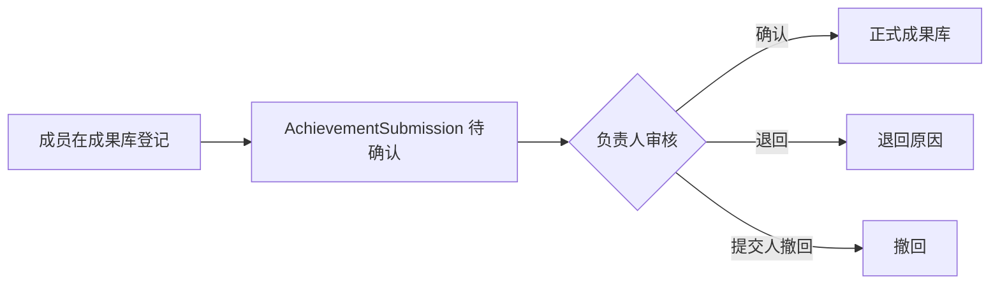
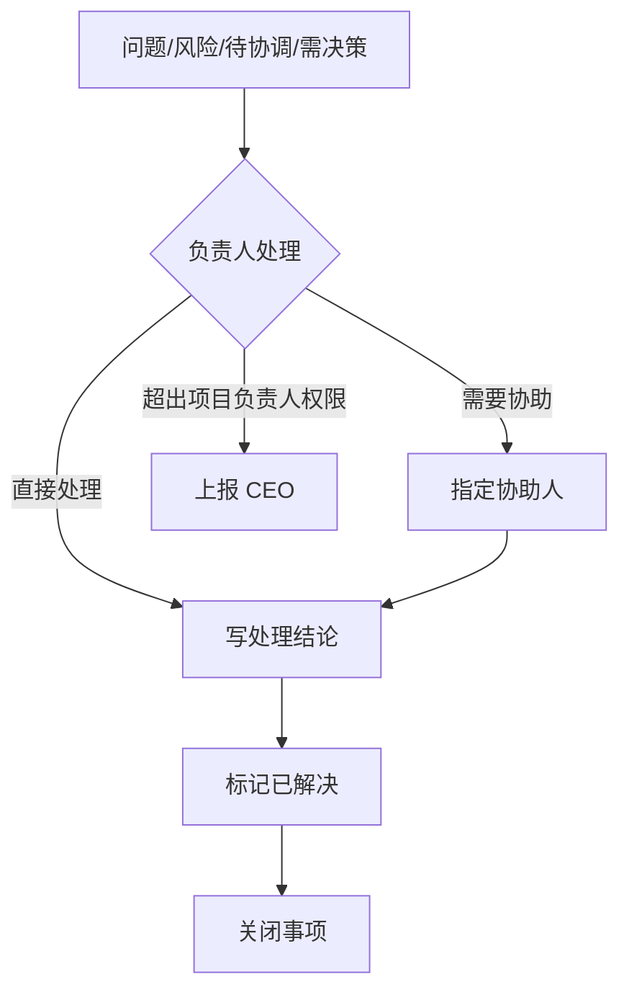

# 上线前系统说明与验收清单

本文档用于正式上线前做系统收束，目标不是重新设计，而是把当前系统已经形成的业务闭环、模块边界、权限规则、测试方法和上线风险统一记录下来，方便开发、测试和后续交接。

## 1. 当前系统定位

本系统的核心不是普通任务清单，而是围绕“项目推进表”的工作事实管理系统。

核心业务主线是：



关键原则：

- 提交是过程，入库才是业务事实。
- 工作推进表承载项目、关键任务、子任务的真实推进状态。
- AI 只做提取和建议，不能绕过人工确认。
- 项目归属以 `project_id` 为准，`special_project` 只做展示或兼容。
- 成果库只登记成果元数据和存储地址，不上传和保存文件本体。

## 2. 本地运行约定

当前本地开发环境约定：

| 服务 | 地址 |
|---|---|
| 后端 | `http://127.0.0.1:8000` |
| 前端 | `http://127.0.0.1:5173` |

后端启动参考：

```powershell
cd D:\frontchange\moways_ai\bowei_ai_dashboard
python -m uvicorn app.main:app --reload --host 127.0.0.1 --port 8000
```

前端启动参考：

```powershell
cd D:\frontchange\moways_ai\frontend
npm run dev -- --host 127.0.0.1 --port 5173
```

上线前必须确认 Vite proxy 指向后端 `8000`，避免前端登录或接口代理请求打到旧端口。

## 3. 功能模块总览

| 模块 | 当前职责 |
|---|---|
| 登录与人员 | 用户登录、角色识别、项目权限判断 |
| 项目与角色 | 项目负责人、统筹人、协同人、项目 CEO、技术管理员等角色边界 |
| 工作推进表 | 项目、关键任务、子任务三层推进结构 |
| 语音更新 | 录音、上传音频、粘贴文字后由 LLM 提取工作更新 |
| AI 确认中心 | 负责人审核提交内容，决定是否入库 |
| 成果库 | 登记可复用成果的元数据和存储地址 |
| 问题与决策 | 记录问题、风险、待协调、需决策事项，并处理闭环 |
| 首页驾驶舱 | 汇总项目、任务、确认、问题、成果等统计 |

## 4. 角色边界

| 角色 | 主要权限 |
|---|---|
| 普通项目成员 | 提交工作更新、提交成果登记、查看自己相关内容 |
| 子任务负责人 | 提交子任务进展或状态变化，但状态变化需要项目负责人确认 |
| 项目负责人 | 审核 AI 提交、确认/退回成果、处理问题与决策、关闭关键任务 |
| 项目统筹人 | 负责协调反馈，不默认拥有最终确认权 |
| 项目 CEO | 查看需 CEO 决策事项，参与高层决策，不参与日常任务推进 |
| 技术管理员 | 系统级管理权限，可处理跨项目管理动作 |

注意：

- 子任务负责人不是直接改库的人，而是提交状态变化的人。
- 项目负责人是项目事实入库和关闭的主要责任人。
- 技术管理员用于系统维护，不应替代真实业务负责人。

## 5. 工作推进表闭环

工作推进表采用三层结构：



### 5.1 项目层

项目层承载专项整体目标、负责人、统筹人、协同人、计划周期和整体状态。

项目状态由关键任务汇总得出，但不能只靠某一条提交自动决定。

### 5.2 关键任务层

关键任务是项目中的里程碑。

关键规则：

- 关键任务可以有多个子任务。
- 子任务全部完成后，只能提醒负责人确认是否关闭关键任务。
- 关键任务不能因为子任务全部完成而自动关闭。
- 已完成关键任务下新增子任务时，关键任务应自动重新打开为进行中。

### 5.3 子任务层

子任务是具体执行动作。

关键规则：

- 子任务可以由项目内成员负责。
- 子任务负责人提交状态变化后，进入确认中心。
- 项目负责人确认后，子任务状态才正式变化。
- 子任务状态可以影响关键任务的推荐状态，但不能替代负责人的最终判断。

## 6. 语音更新与 AI 提取闭环

语音更新包含三种输入方式：

- 录音输入
- 上传音频
- 粘贴文字

三种输入本质一致，最终都进入 LLM 提取流程。



当前设计原则：

- 用户如果只参与一个项目，可以默认选中该项目，但仍应允许人工确认。
- 用户如果参与多个项目，必须明确选择项目，不能让 AI 猜项目。
- 未匹配到现有子任务时，AI 只能提出“建议新增子任务”。
- 建议新增子任务必须由提交人先选择归属关键任务，再提交给负责人。
- 负责人在确认中心可审核和必要时覆盖归属关键任务。

## 7. AI 确认中心闭环

AI 确认中心是提交内容入库前的闸口。



确认中心需要处理的主要类型：

| 类型 | 入库结果 |
|---|---|
| 子任务进展 | 更新子任务进展记录 |
| 子任务完成 | 更新子任务状态为已完成 |
| 建议新增子任务 | 创建新的正式子任务 |
| 成果 | 写入成果库 |
| 问题 / 风险 / 待协调 / 需决策 | 写入问题与决策模块 |

## 8. 成果库闭环

成果库只保存成果的索引信息，不保存文件本体。

正式成果主要字段：

- 成果名称
- 成果类型
- 所属项目
- 关联关键任务
- 负责人
- 版本
- 存储地址
- 使用场景
- 复用标签
- 审核人
- 审核时间
- 来源提交

### 8.1 AI 更新识别成果



来源字段：

- `source_submission_id`：来自语音/文字/会议更新的 `UpdateSubmission`

### 8.2 成果库单独登记



来源字段：

- `source_achievement_submission_id`：来自成果库单独登记的 `AchievementSubmission`

关键原则：

- 两种来源都要先提交后确认。
- 成果库不做文件上传。
- 如果成果地址为空、`无`、`-`、`暂无`、`未填写`，点击打开时应提示未登记地址，不能跳转首页驾驶舱。

## 9. 问题与决策闭环

问题与决策模块统一承载四类事项：

| 类型 | 含义 |
|---|---|
| 问题 | 已经发生、需要处理的阻塞点 |
| 风险 | 尚未发生，但可能影响进度的风险 |
| 待协调 | 需要他人协助或资源配合的事项 |
| 需决策 | 项目负责人需要做判断的事项 |

状态建议：

| 状态 | 含义 |
|---|---|
| 待处理 | 已登记，尚未处理 |
| 处理中 | 已开始处理或已指定协助人 |
| 待决策 | 需要决策人给出判断 |
| 已解决 | 已有处理结论 |
| 已关闭 | 已确认闭环归档 |

处理路径：



注意：

- “需决策”不等于“CEO 决策”。
- 项目负责人可以看到自己项目内的需决策事项。
- 只有确实超出项目负责人权限时，才走上报 CEO 路径。

## 10. 关键设计决定

| 决定 | 说明 |
|---|---|
| `project_id` 是项目归属真值 | 不再依赖 AI 猜出的 `special_project` 决定归属 |
| `confirm_status` 只属于提交流 | 不应混入任务状态 |
| 子任务状态变化需要确认 | 成员提交，负责人确认 |
| 关键任务关闭必须人工确认 | 子任务全完成只提醒，不自动关闭 |
| 成果库只登记地址 | 不上传文件，不保存文件正文 |
| 成果来源要分开 | AI 更新来源和成果登记来源分别记录 |
| 问题与决策统一管理 | 通过类型和状态区分，不拆散成多个互相割裂的页面 |

## 11. 自动化回归测试

### 11.1 后端核心回归

```powershell
cd D:\frontchange\moways_ai\bowei_ai_dashboard
python -m pytest tests/test_regression_workflow.py tests/test_regression_achievements.py tests/test_regression_issues.py tests/test_regression_permissions.py -q
```

预期：全部通过。

### 11.2 成果库前端逻辑

```powershell
cd D:\frontchange\moways_ai
node frontend\tests\achievementFlow.test.mjs
node frontend\tests\achievementsPageStructure.test.mjs
```

预期：全部通过。

### 11.3 语音更新前端逻辑

```powershell
cd D:\frontchange\moways_ai
node frontend\tests\voiceUpdateFlow.test.mjs
```

预期：全部通过。

### 11.4 TypeScript 检查

```powershell
cd D:\frontchange\moways_ai\frontend
npx tsc --noEmit
```

预期：0 errors。

## 12. 人工验收清单

上线前至少人工走通以下场景：

### 12.1 登录与角色

- 项目负责人登录后能看到自己负责的项目。
- 普通成员登录后不能执行负责人确认动作。
- 技术管理员能处理跨项目管理动作。
- 多项目角色用户能切换或识别多个项目，不应只固定一个角色视角。

### 12.2 语音更新

- 单项目用户输入一段进展，能关联到该项目。
- 多项目用户输入一段进展，需要明确选择项目。
- AI 匹配到已有子任务时，显示为子任务进展。
- AI 未匹配到子任务时，显示为建议新增子任务，并要求选择归属关键任务。
- 提交后进入 AI 确认中心。

### 12.3 AI 确认中心

- 负责人确认子任务进展后，工作推进表有变化。
- 负责人确认建议新增子任务后，子任务出现在对应关键任务下。
- 负责人打回后，提交人可以修改后重新提交。
- 需协调、需 CEO 决策路径仍可用。

### 12.4 工作推进表

- 新增子任务后，子任务显示在关键任务下。
- 子任务负责人修改状态后，不直接改库，而是进入确认。
- 子任务全部完成后，关键任务不自动关闭。
- 已完成关键任务新增子任务后，关键任务重新打开。

### 12.5 成果库

- 成果库单独登记后进入待确认成果。
- 负责人确认后进入正式成果。
- 负责人退回后显示退回原因。
- 提交人可以撤回待确认成果。
- 正式成果能关联/取消关联关键任务。
- 空地址或占位地址点击打开时提示未登记地址，不跳转首页驾驶舱。

### 12.6 问题与决策

- AI 识别风险后，进入问题与决策模块，类型为风险。
- AI 识别需决策后，项目负责人能看到。
- 项目负责人可以写处理结论并标记已解决。
- 已解决事项可以关闭。
- 待协调事项可以指定协助人。
- 必要时可以上报 CEO。

## 13. 常用测试文本

### 13.1 子任务进展 + 风险 + 需决策

```text
今天继续推进知识库文档检索功能设计这个子任务，已经完成了检索入口和结果列表的初步页面结构，字段包括文档标题、所属项目、文档类型、关键词、上传人和更新时间。

现在有一个风险：如果本周不能确认文档类型和关键词字段的统一规则，后续检索结果可能会出现分类不一致，影响联调进度。

另外有一个地方需要负责人决策：知识库检索首页第一版是先做关键词搜索，还是先做标签筛选？我建议先做关键词搜索，标签筛选放到第二版。
```

预期：

- 匹配到“知识库文档检索功能设计”相关子任务。
- 完成内容进入子任务进展。
- 风险进入问题与决策，类型为“风险”。
- 决策内容进入问题与决策，类型为“需决策”。

### 13.2 建议新增子任务

```text
今天补充了一个新的想法：后续可以做知识库文档检索功能，让用户按项目、文档类型、关键词和负责人快速查找资料。这个目前还没有对应到现有子任务，可以先作为建议新增子任务提交给负责人判断。
```

预期：

- AI 显示建议新增子任务。
- 提交人必须选择归属关键任务。
- 负责人确认后正式创建子任务。

### 13.3 成果识别

```text
今天整理完成了知识库字段命名规范 V0.1，已经放到公司知识库，地址是 https://example.com/kb/field-rule-v01。这个文档后续可以作为知识库项目的复用成果。
```

预期：

- AI 识别到成果。
- 提交人确认或补录成果地址。
- 负责人确认后进入正式成果库。

## 14. 给 ClaudeCode 的固定验收要求

每次让 ClaudeCode 改核心逻辑后，至少要求它输出以下内容：

```text
请在完成改动后运行以下检查，并把结果贴出来：

1. 后端核心回归：
cd D:\frontchange\moways_ai\bowei_ai_dashboard
python -m pytest tests/test_regression_workflow.py tests/test_regression_achievements.py tests/test_regression_issues.py tests/test_regression_permissions.py -q

2. 前端核心逻辑：
cd D:\frontchange\moways_ai
node frontend\tests\achievementFlow.test.mjs
node frontend\tests\achievementsPageStructure.test.mjs
node frontend\tests\voiceUpdateFlow.test.mjs

3. TypeScript：
cd D:\frontchange\moways_ai\frontend
npx tsc --noEmit

要求：
- 说明改了哪些文件。
- 说明是否改了数据库字段。
- 说明是否影响旧数据。
- 说明哪些测试通过，哪些失败，失败原因是什么。
```

## 15. 上线前最终确认

上线前建议逐项打勾：

- [ ] 后端端口、前端代理、生产环境 API 地址已确认。
- [ ] 管理员账号已准备。
- [ ] 项目、人员、角色数据已初始化。
- [ ] 数据库上线前已备份。
- [ ] 核心自动化回归全部通过。
- [ ] 关键人工验收场景全部通过。
- [ ] 登录页不再出现 500。
- [ ] 成果地址为空时不会跳转首页驾驶舱。
- [ ] AI 提交必须经过负责人确认。
- [ ] 子任务状态变化必须经过负责人确认。
- [ ] 关键任务关闭必须由负责人手动确认。
- [ ] 问题、风险、待协调、需决策都能被负责人看到并处理。

## 16. 当前可接受的技术债

| 技术债 | 建议处理时机 |
|---|---|
| SQLite 并发能力有限 | 正式多用户部署前评估 PostgreSQL |
| 历史兼容字段仍存在 | 稳定运行后再做迁移清理 |
| 缺少端到端浏览器自动化 | 核心流程稳定后补 Playwright |
| 部分权限仍依赖前后端共同约定 | 后续逐步以后端 capabilities 为准 |
| AI 提取准确率依赖提示词和模型 | 上线后根据真实语料持续优化 |

## 17. 后续优化顺序建议

建议不要继续大面积重构，优先按以下顺序收尾：

1. 固定自动化回归命令，作为每次改动后的硬门槛。
2. 补少量 Playwright 端到端测试，覆盖登录、语音更新、确认中心、成果确认、问题处理。
3. 做一次真实角色数据初始化演练。
4. 做一次空库部署演练。
5. 整理正式部署脚本和数据库备份方案。

