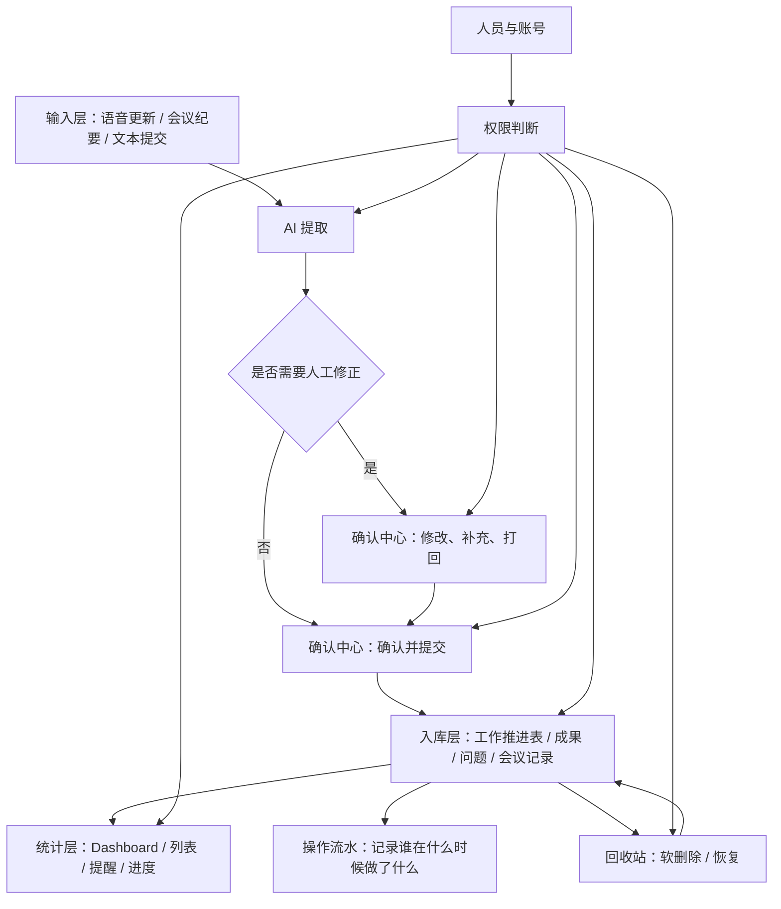

# 业务闭环说明

## 1. 目标

这份说明只回答一件事：系统里一条业务内容从哪里来、怎么被确认、怎么入库、怎么统计、怎么删除、怎么恢复，以及谁能看、谁能改。

当前系统的核心闭环不是“提交了一条记录”，而是“把确认过的业务事实稳定地沉淀到工作推进表和相关派生实体里”。

## 2. 闭环总图

## 3. 链路分层

### 3.1 输入层

输入层负责收集原始内容，来源主要有：

- 语音更新
- 会议纪要
- 文本提交
- 大纲导入

这一层的产物是“待确认的提交”，不是最终业务事实。

### 3.2 确认层

确认层负责把输入内容整理成可以入库的结构，并处理以下动作：

- 修改 AI 提取结果
- 补充遗漏字段
- 打回给提交人
- 重新提交
- 确认入库

这里的状态属于 `confirm_status`，它只描述提交审核流，不直接等于任务状态。

### 3.3 入库层

入库层负责把确认通过的内容写进稳定业务实体，包括：

- `Task`
- `SubTask`
- `Achievement`
- `Issue`
- `Meeting`

入库后，这些实体才算是“已确认的业务事实”。

### 3.4 统计层

统计层不负责改数据，只负责读数据并计算展示口径，例如：

- Dashboard 总览
- 任务状态分布
- 确认中心 tab 数量
- 项目进度
- 风险与待决策项

原则是：**统计口径必须从统一状态语义计算，不反过来驱动业务状态。**

### 3.5 回收站与恢复

删除采用软删除，不是物理删除。

- 关键任务删除后进入回收站
- 子任务随父任务删除时一起进入回收站
- 恢复时按批次恢复父子关系
- 回收站只允许项目负责人和技术管理员操作

这保证误删除可恢复，也便于审计。

### 3.6 权限层

权限层分两种：

- 账号层：谁能登录
- 人员层：这个登录者在项目里是什么角色

系统判断能不能提交流、能不能确认、能不能删、能不能看回收站，最终都要回到人员和项目成员关系，而不是只看账号名。

## 4. 关键规则

### 4.1 提交不等于入库

提交只是“原始信息进入系统”。
入库才是“可长期依赖的业务事实”。

### 4.2 `confirm_status` 只管提交审核

`confirm_status` 不能同时被拿去表示任务完成度、项目进度和确认结果。

### 4.3 工作推进表是事实层

工作推进表里的一条记录代表已经确认的项目事实，它不是草稿，也不是临时输入。

### 4.4 回收站是软删除

删除后数据仍然保留在库中，恢复时按原结构回滚。

### 4.5 统计只读，不反写

统计结果只能展示，不应该直接修改业务对象。

## 5. 责任人视角

- 提交人：录入原始进展
- 负责人：确认是否入库、是否关闭关键任务
- 统筹人：处理协调、反馈、转交
- CEO / 关键审批角色：处理升级事项
- 技术管理员：账号、权限、回收站、系统级收口

## 6. 当前实现对应关系

- 输入层：`/api/updates`、`/api/updates/extract`
- 确认层：`/api/confirmations/*`
- 入库层：`/api/tasks`、`/api/subtasks`、`/api/achievements`、`/api/issues`、`/api/meetings`
- 统计层：`/api/dashboard/*`、确认中心统计接口
- 回收站：`/api/tasks?deleted=true`、`/api/tasks/{id}/restore`、`/api/subtasks/{id}/restore`
- 权限层：`app/permissions.py`、`app/services/policy.py`
- 操作流水：`operation_logs`

## 7. 设计目标

这条闭环后续要持续满足三个目标：

1. 任何一条记录都能追溯来源
2. 任何误操作都能恢复
3. 任何统计都能对上真实业务状态

如果这三个目标同时满足，系统就能从“能用”走到“可长期用”。
